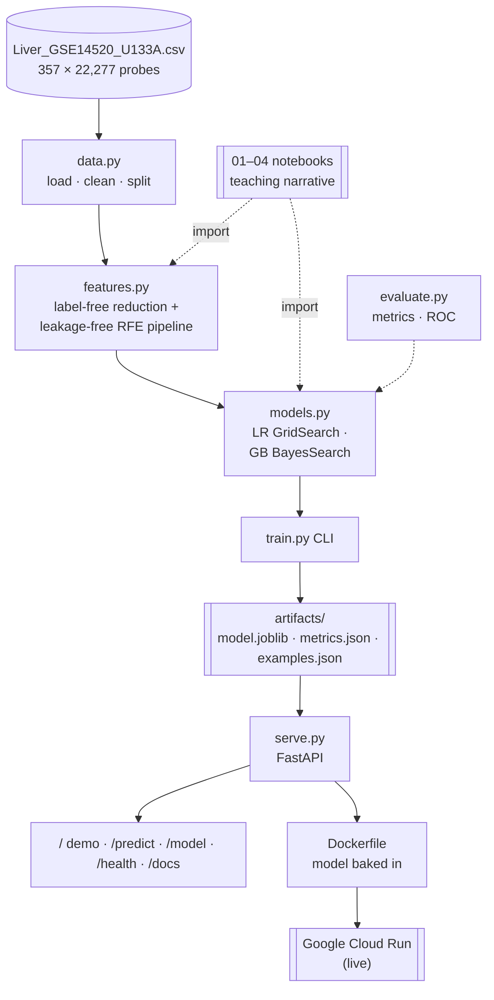

# Liver Cancer Classification — Microarray Gene Expression ML

> ### Recruiter TL;DR
> - **What it is:** an end-to-end ML system that classifies liver biopsies as cancer
>   (HCC) or healthy from 22,277-probe microarray gene expression, served as a live API
>   with an interactive browser demo.
> - **Hardest problem solved:** eliminated **feature-selection leakage** by moving
>   recursive feature elimination *inside* cross-validation — closing a 15-point
>   CV-vs-test gap so the reported scores are honest and defensible.
> - **Result:** **0.958 test F1 / 0.996 ROC-AUC**, **69/72** held-out biopsies correct
>   with **zero false positives**, deployed on **Google Cloud Run**.

[](https://github.com/shiva-shivanibokka/Cumida-ML-Model/actions/workflows/ci.yml)
[](LICENSE)
[](pyproject.toml)

Classify liver tissue as **Hepatocellular Carcinoma (HCC)** or **normal** from
Affymetrix microarray gene-expression profiles (GEO study **GSE14520**: 357
samples × 22,277 gene probes). The project takes a classic high-dimensional,
small-sample biology problem all the way from raw data to a **served, containerised
model** — with the machine-learning methodology done carefully enough to defend
in an interview.

> **In one line:** a reproducible, leakage-free ML pipeline (Logistic Regression &
> Gradient Boosting) reducing 22,277 genes to ~20, wrapped in a tested Python
> package and a FastAPI + Docker serving layer, runnable locally or on Colab.

**🔴 Live demo (Google Cloud Run):** **https://liver-hcc-579593244955.us-central1.run.app**

Open it and click a real held-out biopsy (or draw a random one): its 20 genes render as
a live **expression heatmap**, then the model returns a verdict and a P(HCC) confidence
meter. The page also shows the held-out confusion matrix and the genes the model weights
most. Also exposes the interactive
[API docs](https://liver-hcc-579593244955.us-central1.run.app/docs).
*(Scales to zero, so the first request may cold-start for a few seconds.)*

---

## Highlights

- **Leakage-free by construction.** Supervised feature selection (RFE) runs
  *inside* every cross-validation fold via a scikit-learn `Pipeline`, so reported
  CV scores are honest — CV F1 (0.969) now tracks test F1 (0.958) instead of the
  15-point gap the earlier SMOTE-based version had.
- **Runs anywhere.** One config module auto-detects Colab vs local; the dataset is
  read straight from the repo when running locally, from Drive on Colab. No path
  editing.
- **Not just a notebook.** Core logic lives in an installable package
  (`src/liver_hcc/`) with unit tests, a training CLI, a FastAPI service with
  structured logging, and a Dockerfile.
- **Documented decisions.** `docs/architecture.md` records the design choices as
  ADRs (Architecture Decision Records).

## Results

Held-out test set (72 samples the models never saw during training or tuning):

| Model | Test F1 | ROC-AUC | Precision | Recall | CV F1 | Genes used |
|---|---|---|---|---|---|---|
| **Logistic Regression** (tuned) | **0.9577** | **0.9961** | 1.0000 | 0.9189 | 0.9685 | 20 |
| Gradient Boosting (tuned) | 0.9429 | 0.9842 | 1.0000 | 0.8919 | 0.9648 | 10 |

**Winner: Logistic Regression.** On this clean, strongly-separable dataset the
simple linear model edges out the ensemble — a useful reminder that more complex
isn't automatically better. Both models achieve **perfect precision** (zero
normal samples misclassified as cancer); the difference is recall.

Confusion matrices (positive class = HCC):

| Model | TP | TN | FP | FN |
|---|---|---|---|---|
| Logistic Regression | 34 | 35 | 0 | 3 |
| Gradient Boosting | 33 | 35 | 0 | 4 |

Best hyperparameters — LR: `C=1, penalty=l1` on 20 RFE-selected genes.
GB: `n_estimators=54, learning_rate=0.010, max_depth=3, subsample=0.52` on 10 genes.

> Numbers are produced by `python train.py` and written to `artifacts/metrics.json`
> (committed), so they are reproducible, not hand-copied.

---

## Architecture

The four notebooks and the training CLI import the **same** package modules, so there
is one implementation of every step. `train.py` produces small, committed artifacts
(model + demo samples + metrics) that the FastAPI service bakes into a container and
serves — locally, or on Cloud Run.



**Why this shape:** the notebooks are the *readable* narrative but delegate all logic to
an installable package, so there's no copy-paste drift between "the notebook version" and
"the real version." Supervised feature selection lives *inside* a scikit-learn `Pipeline`
(not as a one-off pre-step) specifically so it is re-fit within every CV fold — the design
decision that makes the reported scores trustworthy. Full reasoning is recorded as ADRs in
[`docs/architecture.md`](docs/architecture.md).

## Skills Demonstrated

Real capabilities this repo exercises (each is backed by code in the tree, not a claim):

- **Production ML deployment / MLOps** — a serving layer (`serve.py`) fully decoupled from
  training/notebook code, with a reproducible `train.py` → versioned model artifact.
- **Cloud deployment (Google Cloud Run)** — source-to-container build via Cloud Build, live
  public endpoint, scale-to-zero.
- **RESTful API design** — a FastAPI service with typed request/response schemas and a
  documented endpoint surface (`/`, `/predict`, `/model`, `/health`, `/docs`).
- **Containerization & Docker** — self-contained image with the model baked in and a
  container healthcheck.
- **Observability & monitoring** — structured JSON logging of every prediction and a
  `/health` readiness probe.
- **CI/CD** — GitHub Actions runs the test suite and an import check on every push/PR,
  across Python 3.11 and 3.12.
- **System design & architecture** — documented decisions/trade-offs as ADRs.
- **Data engineering / feature pipeline** — raw 22,277-probe matrix → model-ready feature
  set through staged, leakage-aware reduction.
- **Automated testing** — `pytest` suite covering a leakage guard, a bug regression test,
  and the API contract.
- **Applied ML rigor** — leakage-free cross-validation, recursive feature elimination,
  grid & Bayesian hyperparameter search, model interpretability, honest evaluation.
- **Frontend for an ML demo** — a self-contained interactive page that calls the model live.

---

## Repository structure

```
Cumida-ML-Model/
├── src/liver_hcc/            ← installable package (the single source of truth)
│   ├── config.py             ← paths, constants, Colab/local auto-detection
│   ├── data.py               ← load / clean / split
│   ├── features.py           ← label-free cleaning + leakage-free selection pipeline
│   ├── models.py             ← LR & GB tuning, deployable-model builder
│   ├── evaluate.py           ← metrics & ROC helpers
│   └── serve.py              ← FastAPI serving app + interactive demo page
├── 01_eda_loading.ipynb      ← EDA (imports from the package)
├── 02_preprocessing.ipynb    ← label-free feature reduction + split
├── 03_logistic_regression.ipynb
├── 04_gradient_boosting.ipynb ← GB + model comparison
├── train.py                  ← end-to-end training CLI -> artifacts/
├── tests/                    ← pytest (leakage guard, bug regression, API contract)
├── artifacts/                ← committed: model.joblib, metrics.json, examples.json
├── docs/                     ← architecture.md (ADRs) + deploy.md (Cloud Run)
├── Dockerfile                ← serving image (model baked in)
├── fly.toml · .gcloudignore  ← deployment config (Cloud Run / Fly.io)
├── pyproject.toml            ← package + dependencies
└── requirements.txt
```

The notebooks are the **teaching narrative**; the package is the implementation.
Both call the same functions, so there is one source of truth for every step.

---

## Quickstart

### Option A — Local (recommended for this repo)

You have the dataset CSV in the repo folder already.

```bash
# 1. Install (editable) with the extras for the full workflow.
#    serve = FastAPI/uvicorn/pydantic · train = plotting + Bayesian search · dev = pytest
pip install -e ".[serve,train,dev]"
# (Serving only? The lean install the Docker image uses is just: pip install ".[serve]")

# 2. Train everything and write artifacts/ (model, metrics, splits)
python train.py

# 3. Run the tests
pytest

# 4. Serve the trained model
uvicorn liver_hcc.serve:app --reload
# then: curl http://localhost:8000/health
```

Everything auto-detects local mode — no path editing. Want a faster smoke test?
`python train.py --gb-iters 5`.

### Option B — Google Colab

1. Upload the notebooks (and the dataset CSV to a Drive folder).
2. In the first cell of any notebook, install the package (with the `train`
   extra, which adds plotting + `scikit-optimize`) from your clone:
   `!pip install -e "/content/Cumida-ML-Model[train]"`.
3. Set the data location if it isn't the default:
   `%env LIVER_HCC_DATA_DIR=/content/drive/MyDrive/your-folder`
4. Run notebooks `01 → 02 → 03 → 04` in order.

`config.mount_drive_if_colab()` mounts Drive automatically on Colab and does
nothing locally.

### How to get the data

The raw file `Liver_GSE14520_U133A.csv` (~128 MB) is **gitignored** — too large for
GitHub. It comes from NCBI GEO accession **GSE14520**, platform **GPL571**
(Affymetrix Human Genome U133A 2.0 Array). Place it in the repo root (local) or
your Drive folder (Colab).

---

## The pipeline

### Notebook 1 — EDA & loading
Loads the raw CSV, confirms 357 samples / 22,277 numeric probes / zero missing
values, visualises class balance (HCC 181 vs normal 176 — essentially balanced),
per-class expression distributions of the most variable genes, a correlation
heatmap, and the overall log-scale expression distribution. Saves
`artifacts/liver_clean.csv`.

### Notebook 2 — Label-free feature reduction
Splits **first** (stratified 80/20, seed 42), then applies only **label-free**
cleaning — zero-variance filter, high-null filter + median impute, and a
**raw-scale** variance filter — reducing 22,277 → **18,608** probes. Supervised
selection is deliberately *deferred* to the model notebooks to avoid selection
leakage (see below). Saves the reduced train/test split.

### Notebook 3 — Logistic Regression
Tunes `C`, `penalty`, **and the RFE feature count** with `GridSearchCV` over the
leakage-free pipeline, evaluates on the test set, and plots the confusion matrix,
ROC curve, and the top gene coefficients (positive = toward HCC).

### Notebook 4 — Gradient Boosting & comparison
Same leakage-free pipeline, tuned with **Bayesian optimisation** (`BayesSearchCV`),
then a head-to-head comparison against a freshly-tuned Logistic Regression on the
identical split.

---

## Serving the model

`train.py` saves a compact `StandardScaler → classifier` model (trained on just
the selected genes) to `artifacts/model.joblib`. The FastAPI app loads it and
exposes:

| Endpoint | Purpose |
|---|---|
| `GET /` | Interactive demo page — pick/draw a real biopsy, live heatmap + prediction |
| `GET /health` | Liveness/readiness probe (used by Docker healthcheck) |
| `GET /model` | Metadata: model type, class labels, and the exact genes it expects |
| `POST /predict` | `{ "features": {gene_id: value, ...} }` → predicted class + P(HCC) |
| `GET /docs` | Auto-generated interactive OpenAPI documentation |

Every prediction is logged as a structured JSON line for observability.

```bash
# Local
uvicorn liver_hcc.serve:app --reload

# Docker (model is baked into the image)
docker build -t liver-hcc .
docker run -p 8000:8000 liver-hcc
```

**Deploy to the cloud:** the image is self-contained, so it runs on any container
platform. This project is deployed on **Google Cloud Run** (source deploy via
Cloud Build — no local Docker needed); a step-by-step walkthrough is in
[`docs/deploy.md`](docs/deploy.md). A `fly.toml` is also included for Fly.io.

Example request (gene ids come from `GET /model`):

```bash
# Fetch the full list of required gene ids from GET /model first.
curl -X POST http://localhost:8000/predict \
  -H "Content-Type: application/json" \
  -d '{"features": {"200910_at": 8.9, "201293_x_at": 10.1, "204641_at": 6.2, ...}}'
```

---

## Testing

```bash
pytest
```

- `tests/test_features.py` — the raw-variance filter, a **regression test** proving
  `VarianceThreshold` after scaling is a no-op (the original bug), and a leakage
  guard that selection precedes the classifier in the pipeline.
- `tests/test_api.py` — the `/`, `/health`, `/model`, and `/predict` contracts against a
  tiny synthetic model (so tests run in milliseconds without the dataset), plus a
  regression test that `/predict` stays warning-free (clean structured logs) and a
  fallback test that the demo page still renders when no artifacts are present.

**CI:** [`.github/workflows/ci.yml`](.github/workflows/ci.yml) runs `pytest` and an
import check on every push and pull request, on Python 3.11 and 3.12.

---

## Methodology notes (a.k.a. what makes this defensible)

**1. Selection leakage — fixed.** Running RFE once on all training data and then
cross-validating a model on the result lets each CV fold "see" its own labels
through the feature set, inflating CV scores. Here, scaling + selection live
inside a `Pipeline` that the search re-fits per fold, and the number of genes is
a tuned hyperparameter. See `docs/architecture.md`, ADR-001.

**2. VarianceThreshold on raw data — fixed.** `StandardScaler` forces every column
to variance 1.0, so a variance threshold applied *after* scaling removes nothing.
The original pipeline did exactly this and misread the "0 removed" result as clean
data. The filter now runs on raw values (removing ~3,669 near-constant probes),
and a regression test locks the behaviour in. See ADR-002.

**3. SMOTE removed.** An earlier version applied SMOTE to the ~50/50 balanced
training set, which both was unnecessary and leaked synthetic neighbours across CV
folds. Removing it is why CV and test scores now agree.

**4. F1 as the primary metric.** Although the classes are balanced, F1 separates
precision and recall, which matter differently in a medical setting (a missed
cancer vs a false alarm).

---

## Libraries

Dependencies are split into extras in `pyproject.toml` so the serving image stays
lean (it installs only the core + `serve` group — no plotting or tuning libraries):

| Library | Purpose | Group |
|---|---|---|
| `pandas`, `numpy` | Data handling | core |
| `scikit-learn` | Models, pipeline, selection, metrics | core |
| `joblib` | Model serialisation | core |
| `fastapi`, `uvicorn`, `pydantic` | Serving layer | `serve` |
| `scikit-optimize` | `BayesSearchCV` for Gradient Boosting tuning | `train` |
| `matplotlib`, `seaborn` | Plots (notebooks) | `train` |
| `pytest`, `httpx` | Tests | `dev` |

---

## Background — the biology (why this problem matters)

**Hepatocellular Carcinoma (HCC)** is the most common primary liver cancer and a
leading cause of cancer death worldwide, usually developing on top of cirrhosis
from hepatitis B/C, alcohol, or fatty liver disease. Because it often develops
silently, early molecular detection is valuable.

**Gene expression profiling** measures which genes are switched on in a tissue.
An Affymetrix microarray is a chip of thousands of DNA probes; the binding at each
probe gives a numeric expression value per gene. When a cell becomes cancerous,
its expression pattern shifts in detectable ways.

**Why ML:** with 22,277 features and only 357 samples, this is a high-dimensional,
small-sample problem. Individual statistical tests consider one gene at a time; ML
finds *combinations* of genes that separate cancer from normal — the challenge
being to do so without overfitting. **GSE14520** is well-suited to this: tumour
and adjacent non-tumour tissue come from the same patients (a paired design),
giving a clean, genuinely learnable signal.

---

## Roadmap / Limitations

Honest about what this is and isn't:

- **Single cohort.** Results reflect one clean, paired-design study (GSE14520). External
  validation on an independent cohort or a different microarray platform would test
  whether the selected genes generalise — the natural next step.
- **Probe IDs, not gene symbols.** The model uses Affymetrix probe IDs directly; mapping
  them to gene symbols (e.g. via a GPL571 annotation) would improve biological readability.
- **Educational, not clinical.** This is a portfolio/learning project, not a validated
  diagnostic tool.

## License

Released under the [MIT License](LICENSE) — free to use, modify, and distribute with
attribution. The dataset (GEO **GSE14520**) is subject to its own NCBI GEO terms.
