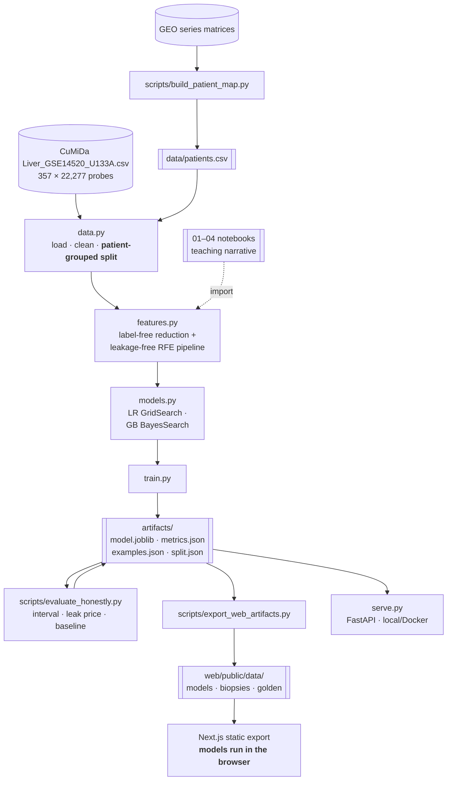

# Liver Cancer Classification — Microarray Gene Expression ML

**An end-to-end ML system that classifies liver biopsies as hepatocellular carcinoma (HCC)
or normal tissue from 22,277-probe microarray gene expression — built to be defensible
rather than impressive, with the split, the error bars and the baseline reported next to
the score.**

Built by Shivani Bokka.

**Try it: <https://liver-hcc.vercel.app>** — pick a held-out biopsy and both models run
**in your browser**. There is no backend.

[](https://github.com/shiva-shivanibokka/Cumida-ML-Model/actions/workflows/ci.yml)
[](LICENSE)
[](pyproject.toml)

---

### Recruiter TL;DR

- **What it is** — a reproducible pipeline from a 357 × 22,277 gene-expression matrix to a
  trained, tested, served model, plus a static demo page that runs that model client-side.
- **Hardest problem solved** — the evaluation, twice. First, **feature-selection leakage**:
  recursive feature elimination moved *inside* cross-validation. Then the one that actually
  changed the numbers — **patient leakage**: GSE14520 is a paired study, and **48 of the 72
  "held-out" biopsies had their own patient's opposite tissue sitting in the training set**.
- **Result** — **F1 0.9589, ROC-AUC 0.9892** on a patient-grouped held-out set, *and* the
  context that makes it meaningful: a 95% interval of **[0.903, 1.000]**, and a
  **single probe with no model at all scoring AUC 0.980**.

---

## The headline number, and what it is worth

Held-out test set: 72 biopsies from 38 patients, none of whom appear in training.

| Model | Test F1 | ROC-AUC | Precision | Recall | CV F1 | Genes |
|---|---|---|---|---|---|---|
| Logistic Regression | 0.9589 | 0.9684 | 0.9459 | 0.9722 | **0.9714** | 10 |
| **Gradient Boosting** (shipped) | 0.9589 | **0.9892** | 0.9459 | 0.9722 | 0.9650 | 20 |

Three things belong next to that table, and leaving them out is how this kind of project
gets oversold:

**1. The two models are not separable by F1 — and not identical either.** They reach the
*same confusion matrix* (TP 35, FN 1, FP 2, TN 34) by getting **different biopsies wrong**.
Each is wrong three times; they share only two of those mistakes, and they disagree on two
biopsies outright. Identical summary statistics, different behaviour. Cross-validation, for
its part, ranks them the other way round. The shipped model is Gradient Boosting on an
explicit ROC-AUC tie-break — a stated rule, not a finding.

**2. The test set is 72 samples, so the error bar is enormous.** Bootstrapping it 10,000
times gives a 95% interval of **[0.9032, 1.0000]** — nearly 0.10 wide. One extra missed
tumour moves the score further than the entire gap between the two models.

**3. The task is close to solved before any modelling.** Scoring each of the 22,277 probes
on its own — one number, one threshold, no training — the best (`207804_s_at`) reaches
**AUC 0.980**, and **108 probes clear 0.95 alone**. Tumour and adjacent normal liver differ
enormously in expression. The work worth showing here is the methodology, not the fourth
decimal place.

All three are computed by [`scripts/evaluate_honestly.py`](scripts/evaluate_honestly.py)
and committed to `artifacts/honesty.json`.

## Patient leakage: the fix that mattered

GSE14520 is a **paired** study. Of its 189 patients, **165 contributed both a tumour biopsy
and a matched non-tumour biopsy from the same liver.** A split stratified on the label alone
is blind to that, so it routinely puts one of a patient's two biopsies in training and the
other in test.

Measured on the split this project used to make:

```
ungrouped, stratified split : 48 of 72 held-out biopsies (67%) shared a patient with training
patient-grouped split       : 0
```

The model had not seen those *samples*. It had seen those *livers*, labelled the other way.

**Honest accounting: the leak was real but cheap.** Running the identical pipeline both ways
over 10 splits, grouping costs **0.008 F1** — inside the seed-to-seed spread (±0.027). The
tumour signal is large enough that knowing the patient adds little. It is fixed anyway,
because "biopsies the model has never seen" has to be *true* rather than nearly true. Note
that the spread *widens* once the leak is gone: the honest evaluation is the harder one.

The pairing is not in the CuMiDa CSV — it lives in GEO's series matrix, as source names like
`LCS-039A` / `LCS-039B` (same patient, A = tumour, B = non-tumour).
[`scripts/build_patient_map.py`](scripts/build_patient_map.py) recovers it and commits
`data/patients.csv`, so training needs no network. `data.make_split` **refuses to run
without it**, and `tests/test_split.py` re-derives the patient sets from the committed split
and fails if any patient straddles it — plus a test that the *ungrouped* split still leaks,
so the guard cannot quietly become vacuous.

## The data

**Source: [CuMiDa](https://sbcb.inf.ufrgs.br/cumida)** — the Curated Microarray Database
(Feltes et al., 2019) — file `Liver_GSE14520_U133A.csv`, which curates **GEO accession
GSE14520** (platforms GPL571 and GPL3921, Affymetrix U133A). 357 biopsies × 22,277 probes,
RMA-normalised, one row per sample with a `type` label.

**This is not a file you can download from GEO.** GEO gives you CEL files or a series matrix
with probes as rows and no label column; the sample × probe CSV with an `HCC`/`normal`
column is CuMiDa's curation. Get it from CuMiDa (Liver → GSE14520 → U133A) and place it in
the repo root. It is ~128 MB and gitignored.

The patient map is built from GEO's series matrices, which *are* fetched from NCBI — that is
the only part of this project that touches the network, and the result is committed.

## Architecture

The notebooks, the training CLI and the serving layer all import the **same package**, so
there is one implementation of every step. Training writes small committed artifacts; the
demo page is generated from those artifacts and runs the models client-side.



**Why the browser.** Both models are small and closed-form once fitted: logistic regression
is a dot product behind a sigmoid, and the gradient booster is 180 depth-3 trees — a walk
down 180 short paths. Exporting the fitted parameters and evaluating them in TypeScript is
not an approximation of the model, it *is* the model. `web/lib/model.ts` does it in ~40
lines, and CI re-predicts all 72 biopsies with that exact module and compares against
scikit-learn:

```
$ npm run check:golden
checked 144 predictions across 2 models
largest disagreement with scikit-learn: 5.612e-13
the browser reproduces scikit-learn.
```

That check earns its place. Making the module read gene order from sorted JSON keys instead
of the fitted column order — a plausible refactor — moves one biopsy from 0.957 to 0.477 and
flips its verdict. The check catches it; nothing else would.

The site is a folder of static files. No server, no cold start, nothing to expire.

## Repository structure

```
Cumida-ML-Model/
├── src/liver_hcc/            ← installable package (the single source of truth)
│   ├── config.py             ← paths, constants, Colab/local auto-detection
│   ├── data.py               ← load / clean / patient-grouped split
│   ├── features.py           ← label-free cleaning + leakage-free selection pipeline
│   ├── models.py             ← LR & GB tuning, deployable-model builder
│   ├── evaluate.py           ← metrics, and an explicit tie-break
│   ├── serve.py              ← FastAPI service (local / Docker)
│   └── train.py              ← the training CLI
├── scripts/
│   ├── build_patient_map.py  ← GEO → data/patients.csv  (--check)
│   ├── evaluate_honestly.py  ← interval, leak price, baseline  (--check)
│   └── export_web_artifacts.py ← artifacts → web/public/data  (--check)
├── web/                      ← Next.js static export; models run client-side
│   ├── lib/model.ts          ← the models, in TypeScript
│   └── scripts/check-golden.ts ← re-predicts against scikit-learn's answers
├── 01–04 *.ipynb             ← the teaching narrative
├── train.py                  ← shim onto liver_hcc.train
├── data/patients.csv         ← which patient each biopsy came from
├── artifacts/                ← committed: model, metrics, demo samples, split, honesty
├── tests/                    ← API contract, leakage guards, artifact agreement
└── docs/                     ← architecture.md (ADRs)
```

## Quickstart

```bash
pip install -e ".[serve,train,dev]"

python scripts/build_patient_map.py --fetch   # once: recovers patient ids from GEO
python train.py                               # trains, writes artifacts/
python scripts/evaluate_honestly.py           # interval, leak price, baseline
python scripts/export_web_artifacts.py        # regenerates the site's data
pytest

uvicorn liver_hcc.serve:app --reload          # the API, locally
cd web && npm install && npm run dev          # the demo page, locally
```

`python train.py --gb-iters 5` is a faster smoke test. Everything auto-detects Colab vs
local; on Colab set `LIVER_HCC_DATA_DIR` and run notebooks `01 → 02 → 03 → 04`.

## The pipeline

**Notebook 1 — EDA.** 357 samples, 22,277 numeric probes, zero missing values, near-balanced
classes (181 HCC / 176 normal). Saves `artifacts/liver_clean.csv` — **keeping the sample-id
column**, because it is the only way to look up which patient a biopsy came from.

**Notebook 2 — label-free reduction.** Splits **first** (patient-grouped, 285/72), then
applies only label-free cleaning: zero-variance filter, high-null filter + median impute, and
a **raw-scale** variance filter, reducing 22,277 → 18,580 probes. Supervised selection is
deliberately deferred to the model notebooks.

**Notebook 3 — Logistic Regression.** Tunes `C`, `penalty` **and the RFE feature count** with
`GridSearchCV` over the leakage-free pipeline. Best: `C=0.1, penalty=l1` on 10 genes.

**Notebook 4 — Gradient Boosting & comparison.** Same pipeline, `BayesSearchCV`, then a
head-to-head on the identical split.

A detail worth keeping: a plain logistic regression on **all 18,580 probes** scores F1
0.9722 — *higher* than the tuned 10-gene model. Selection buys interpretability and a
10-value API, not accuracy. On this test set that difference is one biopsy.

## Serving

`serve.py` exposes `/health`, `/model`, `/predict` and `/docs`, with structured JSON logging
of every prediction, and ships as a self-contained Docker image with the model baked in.

```bash
uvicorn liver_hcc.serve:app --reload
docker build -t liver-hcc . && docker run -p 8000:8000 liver-hcc
```

**It is not publicly hosted, deliberately.** The interactive demo is the static page, which
runs the same models in the browser and cannot go dark. An earlier version of this repo
embedded a ~340-line copy of that demo inside `serve.py` and had it call `/predict`; two
demos that must agree with one model is one demo too many, and the one that can be checked
against the model is the one that stayed.

## Testing

```bash
ruff check . && pytest -q
cd web && npm run check:golden && npm run typecheck && npm run build
```

- **`tests/test_split.py`** — no patient straddles the committed split; the *ungrouped*
  split still leaks (so the guard is not vacuous); `make_split` refuses to run without
  groups; an incomplete patient map raises rather than silently under-grouping.
- **`tests/test_artifacts.py`** — the committed model reproduces the committed metrics on
  the committed held-out biopsies. Every other test builds a synthetic model to stay fast;
  a synthetic model structurally cannot check that claim.
- **`tests/test_features.py`** — the raw-variance filter, a regression test proving
  `VarianceThreshold` after scaling is a no-op (the original bug), and a leakage guard on
  pipeline order.
- **`tests/test_api.py`** — the `/`, `/health`, `/model`, `/predict` contracts, plus a
  regression test that `/predict` stays warning-free.
- **`web/scripts/check-golden.ts`** — the browser against scikit-learn, above.

CI runs all of it on Python 3.11 and 3.12, plus the site build.

One test is worth calling out because it changed the page. It originally asserted the two
models return the same 72 predictions — reasonable, given byte-identical confusion matrices.
It failed. The same counts are reachable by getting *different* biopsies wrong, and the
page's headline had to be rewritten from "the same 72 answers" to "identical scores,
different mistakes".

## Methodology notes

**1. Selection leakage — fixed.** RFE runs *inside* a `Pipeline` that the search re-fits per
CV fold, with the number of genes tuned as a hyperparameter. See ADR-001.

**2. Patient leakage — fixed.** See above, and `data.py`'s module docstring.

**3. `VarianceThreshold` on raw data — fixed.** `StandardScaler` forces every column to
variance 1.0, so a threshold applied *after* scaling removes nothing. The original pipeline
did exactly that and read "0 removed" as clean data. See ADR-002.

**4. SMOTE removed.** Applied to an already-balanced training set, and it leaked synthetic
neighbours across CV folds.

**5. No warnings are suppressed.** An earlier version silenced sklearn's `FutureWarning` as
harmless deprecation noise. The warning it hid was that `LogisticRegression(penalty=...)`
— how the tuned model is specified — is removed in scikit-learn 1.10. `scikit-learn<1.10`
is now pinned, so the ceiling is declared rather than discovered.

## Limitations

- **Single cohort, and an easy one.** One curated benchmark of paired tumour/non-tumour
  liver tissue. External validation on an independent cohort or platform is the real next
  step; see the single-probe baseline above for why the score here is not the achievement.
- **Probe IDs, not gene symbols.** Mapping via a GPL571 annotation would improve readability.
- **72 test samples.** Every comparison on this page is quoted with that in mind.
- **Educational, not clinical.** A portfolio project, not a validated diagnostic tool.

## License

Released under the [MIT License](LICENSE). The dataset is redistributed by CuMiDa and
originates from GEO **GSE14520**; both carry their own terms.
